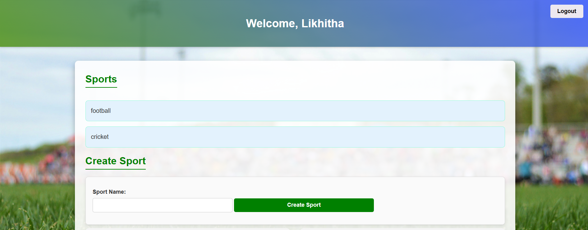
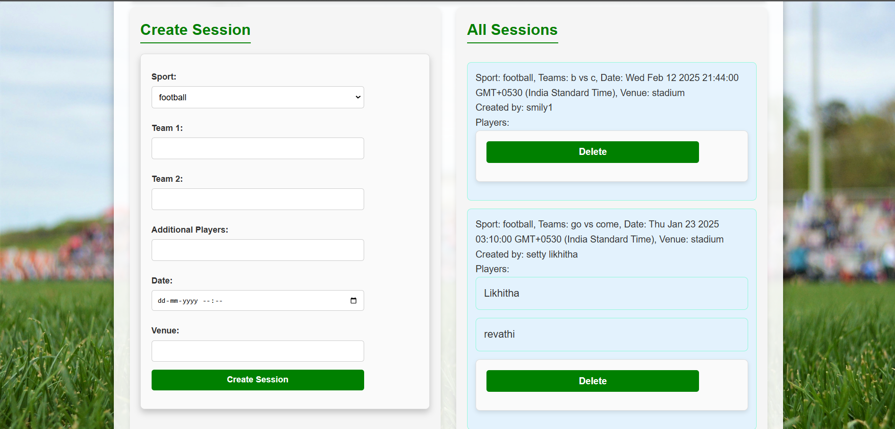
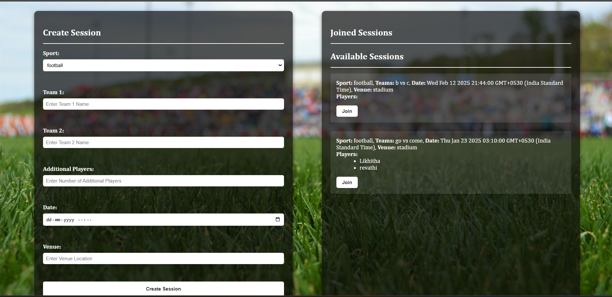
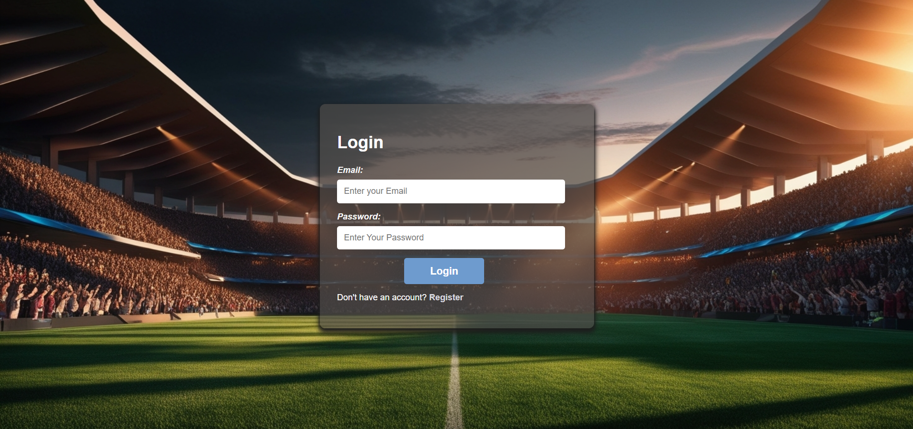
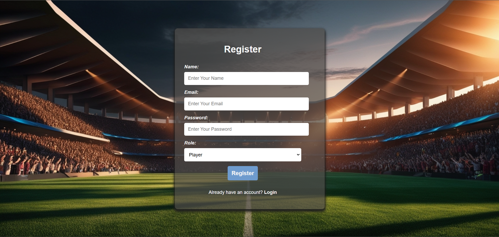

# Sports Scheduler:Your Ultimate Sports Event Organizer 🏆

## Overview

Welcome to **Sports Scheduler**, a feature-rich web application designed to streamline sports event planning and participation. Built as part of the WD501 course, this platform offers both administrators and players a user-friendly interface to manage and engage in sports sessions effortlessly.

## Sports Scheduler

This web application helps you schedule sports events efficiently. You can also check out the GitHub repository [here](https://github.com/Likhitha-Setty).

## Project Highlights

### The Challenge 🌟

Developed as the final project in WD501, the challenge was to create a fully functional Sports Scheduler that enables individuals to plan and participate in sports events, promoting increased engagement in physical activities.

### Personas 🚀

#### The Administrator 🧑‍💼

- Manages sports available for users.
- Creates, edits, and deletes various sports options.
- Accesses reports on games played.




#### The Player 🏅

- Registers and logs in with an email and password.
- Creates sport sessions.
- Joins existing sport sessions.
- Manages created and joined sessions.



### User Stories in Action 🎬

1. **Admins can create sports:**

   - Sign in, view created sports, and add new sports with ease.

2. **Players can sign up and sign in:**

   - Enjoy a smooth onboarding experience with user-friendly forms.




3. **Players can create a sport session:**

   - Create and customize sport sessions effortlessly.

4. **Players can view and join existing sport sessions:**

   - Discover and join sessions seamlessly.

5. **Admins can create a sport session:**

   - Administrators enjoy the same seamless session creation.

## Getting Started 🚀

1. **Clone the repository to your local machine** using the following command:
   ```bash
   git clone https://github.com/Likhitha-Setty/sports-scheduler.git
   ```
2. **Set up the required dependencies and environment:**
   Install all required packages with:

   ```bash
   npm install
   ```

3. **Run the application locally for testing and development:**
   ```bash
   npm start
   ```

## Technologies Used 💻

- **EJS** for templating dynamic HTML pages.
- **HTML and CSS** for front-end design and styling.
- **PostgreSQL** as the database for storing application data.
- **Express.js** as the backend framework.

## Acknowledgments 🙌

This project was developed as part of the WD501 course. Special thanks to the instructors and course materials for providing valuable guidance throughout the development process.
